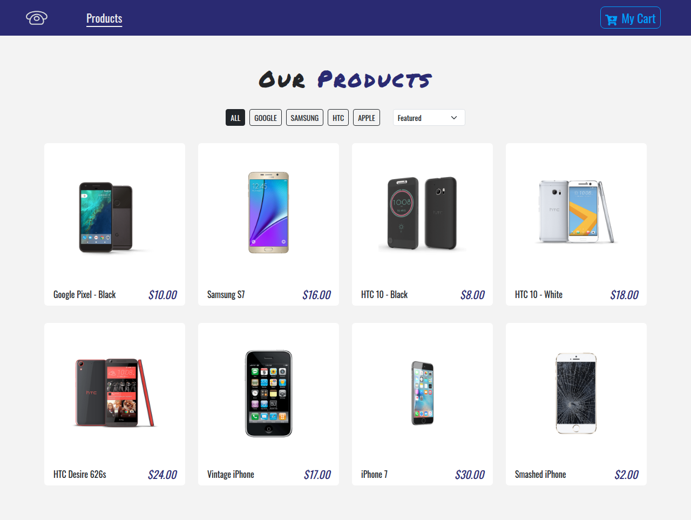
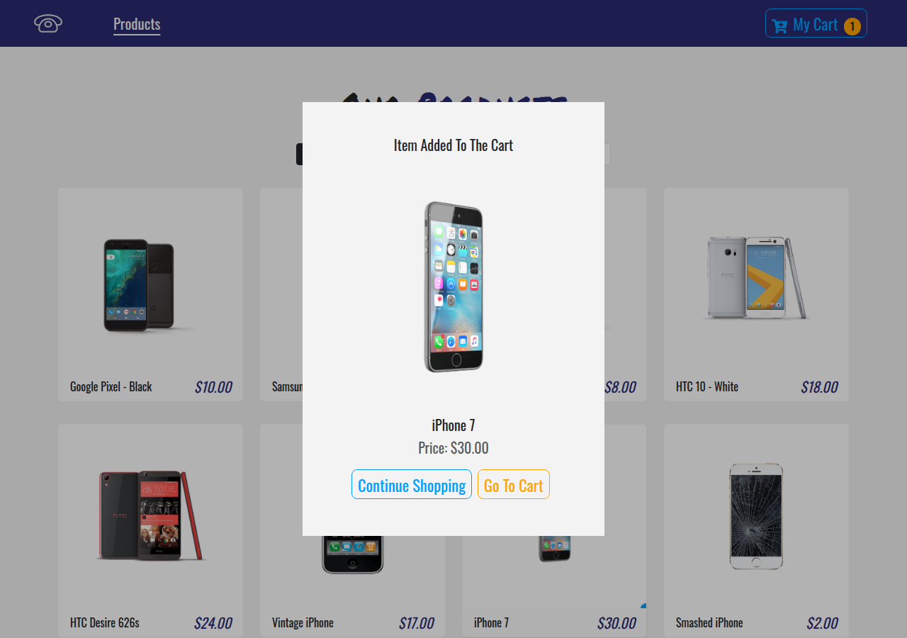
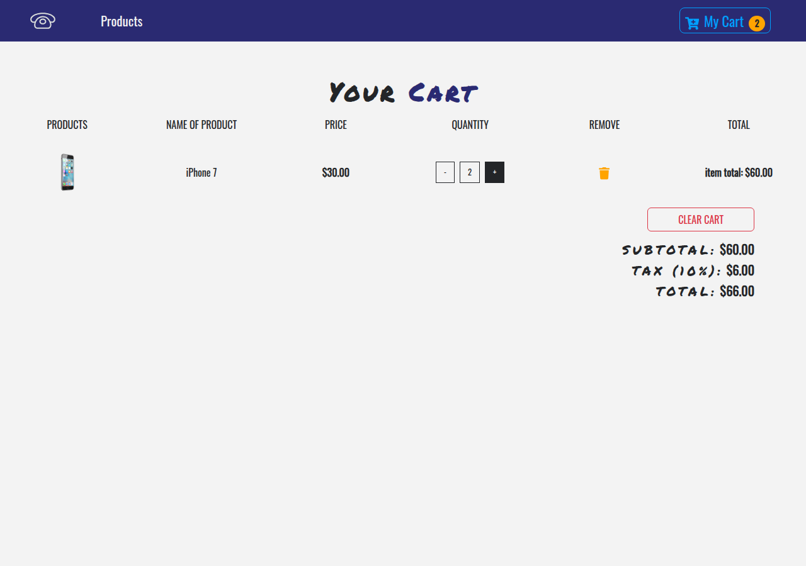

# Phone Store

[](https://github.com/salehinafnan/blog-website-back-end/actions/workflows/ci.yml)

A small single-page phone shop built with React. It has a product catalogue
with brand filters and sorting, product detail pages, an "added to cart"
dialog, and a cart that remembers its contents between visits.



| Added to cart                    | Cart                   |
| -------------------------------- | ---------------------- |
|  |  |

## Features

- **Catalogue** with brand filter chips and price sorting. The filter state
  lives in the URL (`/?brand=apple&sort=price-asc`), so views can be shared
  and bookmarked.
- **Product pages** at `/product/:id`. Refreshing or deep-linking always shows
  the right product, and unknown IDs get a 404 page.
- **Cart** with quantity controls, per-line totals, subtotal, 10% tax and
  total, all formatted as currency. The cart is saved to `localStorage` and
  checked against the catalogue when it loads.
- **Accessible dialog**: the "added to cart" dialog closes with Esc or a
  backdrop click, and focus moves into it when it opens. Every control is a
  real `<button>` with a label.
- **No external CDNs**. Icons come from `react-icons` and fonts are
  self-hosted through `@fontsource`.

## Tech stack

React 19 · React Router · styled-components · Bootstrap 5 · Vite · Vitest +
Testing Library

## Getting started

```bash
npm install
npm run dev       # http://localhost:5173
npm test          # unit + integration tests
npm run build     # production build in dist/
```

Requires Node 20.19+ or 22.12+ (Vite 8).

## Project structure

```
src/
├── data/products.js          # catalogue + lookup helpers
├── store/
│   ├── cart.js               # pure reducer, totals, persistence guard, currency formatting
│   └── CartContext.jsx       # provider + useCart() hook, localStorage sync
├── components/               # Navbar, ProductCard, AddedToCartModal, Button, Title
├── pages/                    # ProductList, ProductDetails, Cart/*, NotFound
└── App.jsx / main.jsx        # routes + providers
```

Cart state is only `[{ id, count }]`. Product data, line totals, tax and item
counts are derived from it on every render and never stored. This rules out
the stale-state bugs the original version had.

## Deploying to GitHub Pages

The workflow in `.github/workflows/pages.yml` builds the app with the correct
base path and deploys it. To enable it:

1. In the repo, go to **Settings → Pages → Source** and choose **GitHub Actions**.
2. On the **Actions** tab, run **deploy to pages**.

## History

This started as my week-3 assignment for a MERN course. The original code
was written in 2019-era Create React App style, and it no longer installed or
ran. I rebuilt it in 2026. It keeps the original look, with a modern stack
and fixes for the bugs listed below.

| Before                                                                                                   | After                                                        |
| -------------------------------------------------------------------------------------------------------- | ------------------------------------------------------------ |
| `react-scripts` 2 lockfile pinned a macOS-only package, so `npm ci` failed on Linux                      | Vite 8, and a clean install works everywhere                 |
| The product page read a single "current product" from state, so a refresh always showed the Google Pixel | Route is `/product/:id`                                      |
| Cart actions mutated product objects in place                                                            | Pure reducer, and state is never mutated                     |
| The cart was lost on refresh                                                                             | The cart is saved to `localStorage`                          |
| Totals printed as `$ 68.2`                                                                               | Totals are formatted with `Intl.NumberFormat` (`$68.20`)     |
| Clickable `<span>`s and a modal you couldn't close with the keyboard                                     | Real buttons, ARIA labels, and a dialog that closes with Esc |
| One smoke test, which crashed because the providers were missing                                         | 13 tests covering the reducer and the user flows             |

## Credits

The logo is the "call phone" icon by
[Makoto_msk](https://www.iconfinder.com/Makoto_msk) on
[Iconfinder](https://www.iconfinder.com/icons/1243689/call_phone_icon),
licensed under CC BY 3.0. The product images are demo assets that came
with the original assignment.
